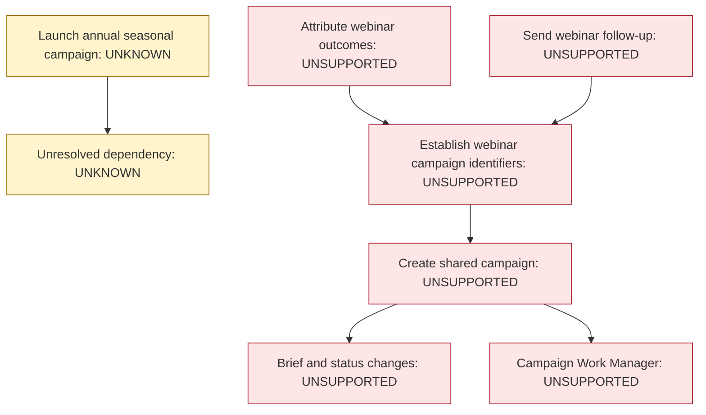
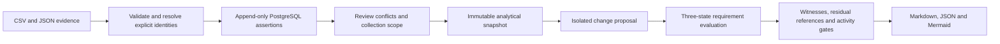

# MarTech Estate Impact

**Before retiring a Marketing platform, what depends on it—and what evidence would justify the decision?**

A tool inventory can identify overlapping products. It cannot, by itself, establish whether a campaign workflow can survive a platform change. This repository reconciles architecture evidence, preserves disagreements, and evaluates proposed changes against explicit business requirements.

The demonstration models a fictional enterprise Marketing estate with **24 current systems, 2 proposed replacements, 40 integration claims and 10 business capabilities**. A seemingly replaceable work-management platform supplies the brief and status feed used to create shared campaigns. Retiring it breaks the declared chain from campaign creation to webinar identifiers, follow-up and attribution. Registration remains supported. An annual seasonal dependency remains **Unknown** because its evidence conflicts and its observation window is incomplete.

The estate, source evidence and results are synthetic.



*Actual generated retirement witness view, reproduced by the PostgreSQL demo. Arrows point from a requirement to its prerequisite. Unsupported and Unknown are distinct; unchanged supported requirements, including registration, are intentionally omitted. [Full assessment, evidence and prerequisites](examples/generated/retire-work-manager-assessment.md).*

## See the result before installing anything

| Proposal | Derived result | Important boundary |
|---|---|---|
| Retire legacy work management | Four requirements unsupported; seasonal requirement Unknown | Registration and optional operational reporting remain supported |
| Incomplete webinar replacement | Three requirements unsupported | Missing attendance event, campaign field and correlation key; registration remains supported |
| Revised webinar replacement | No identified blockers within reviewed scope | Declared metadata gaps closed; operational acceptance gates remain open |

Start with the generated [estate overview](examples/generated/estate-overview.md), [campaign map](examples/generated/campaign-workflow-diagram.md), [retirement assessment](examples/generated/retire-work-manager-assessment.md) and [retirement witness diagram](examples/generated/retire-work-manager-impact-diagram.md). Then compare the [incomplete replacement](examples/generated/replace-webinar-incomplete-assessment.md) with the [revised assessment](examples/generated/replace-webinar-revised-assessment.md), [target architecture](examples/generated/webinar-target-state-diagram.md) and [exact declared diff](examples/generated/target-state-diff.md).

These files are generated by the actual PostgreSQL demo. Matching JSON results, a snapshot and an [evidence index](examples/generated/evidence-index.json) sit alongside them. Use the [8-minute guided walkthrough](docs/demonstration-walkthrough.md) to present the repository without navigating source files.

## How the analysis works



Four distinctions drive the implementation:

- **Connectivity is not dependency.** Integration data flows identify connected systems; only typed requirement inputs establish business dependence.
- **Reachability is not failure.** A connected registration platform can remain supported when another campaign workflow fails.
- **A capability label is not a substitute qualification.** An alternative must have an explicit qualification claim and satisfy any declared interface contract.
- **Missing evidence is not absence.** Stale definitions, conflicting claims, ambiguous identities and incomplete collection remain visible. Zero recent executions do not establish disuse.

### Evidence and uncertainty

Each source assertion retains the source, artifact checksum, collection timestamp, collection scope and source location. A versioned policy admits sources by assertion type; it has no universal source ranking. Conflicts between admissible claims remain disputed until a recorded reviewer decision accepts specific assertion IDs. Assertions are preserved even when rejected. Two aliases resolve to one system through an explicit crosswalk; similarly named Work Manager and Work Review remain distinct.

The demo publishes an unresolved snapshot and then a reviewed snapshot. A product-analytics dependency changes from Unknown to Supported through a retained decision. Work-management accountability remains disputed, and an old personalization integration stays unresolved.

Complete fixture manifests describe a **point-in-time review of declared architecture**, not complete runtime observation. The execution export remains partial. Work management has an incomplete seasonal collection scope; the replacement review cannot be used as evidence that the entire estate has been discovered.

### Requirement semantics

| Group | Supported | Unsupported | Unknown |
|---|---|---|---|
| ALL | All mandatory inputs supported | At least one established mandatory failure | No established failure, but some required evidence unresolved |
| ANY | At least one qualified supported alternative | All candidates definitely fail qualification/support | No support and at least one unresolved candidate |

Optional inputs do not determine mandatory group status. Empty groups do not prove support. The evaluator starts unresolved nodes at Unknown and computes a fixed point: a cycle without an external foundation cannot support itself. Data-flow cycles are permitted. Activity-prerequisite cycles are separately reported as planning contradictions.

The assessment also checks dangling references to retired systems and detects changed requirement outcomes outside the selected scope. A supported alternative alone does not excuse an integration still pointing to a retired endpoint. Witness branches retain evidence references; they are bounded explanations, not minimal cut sets or probabilities.

## This is not a CMDB

CMDBs and inventories can supply valuable evidence. This project's purpose is an analytical decision: reconcile heterogeneous claims, preserve conflicts and provenance, qualify coverage, evaluate explicit business requirements in an isolated counterfactual, and explain the outcome through witness paths, alternatives, residual references and change prerequisites. It does not replace an enterprise inventory, discovery service or operating system of record.

## Run locally

Use Python 3.12 and Docker Compose. From this repository directory, create a virtual environment:

```text
python -m venv .venv
```

On Windows PowerShell, activate it with `.venv\Scripts\Activate.ps1`. On macOS/Linux, use `source .venv/bin/activate`. If PowerShell activation is restricted, run the commands below with `.venv\Scripts\python.exe` in place of `python`; changing the machine's execution policy is unnecessary.

```text
python -m pip install -r requirements.lock
python -m pip install --no-build-isolation --no-deps .
docker compose up -d --wait
python scripts/demo.py
python scripts/verify.py
```

Both scripts apply the idempotent SQL migration automatically. Defaults match Compose; no secret or `.env` setup is needed for the synthetic loopback-only demo. An existing PostgreSQL instance can be selected using `ESTATE_DATABASE_URL`; see [.env.example](.env.example) and [operations](docs/operations.md). There is no SQLite fallback. Verification creates and drops only its own randomly named test schema; use a dedicated demo database.

## Observed verification

Local verification used **Windows, Python 3.12.14 and native PostgreSQL 17.11**. The [generated verification report](examples/generated/verification-report.md) records the latest measured test count, failures, skips and implementation fingerprint; [machine-readable evidence](docs/evidence/verification.json) includes source hashes. The suite includes 350 generated bounded graphs checked against an independent recursive reference evaluator, metamorphic changes, transaction rollback, concurrent duplicate imports and end-to-end regeneration.

Docker Compose is supplied but was **not run** in the implementation environment. [GitHub Actions](.github/workflows/verify.yml) provisions PostgreSQL and runs verification; **hosted verification has passed for the published build**. That hosted result is separate from the successful local PostgreSQL run.

## Decisions and limits

Python owns the reasoning; PostgreSQL owns durable evidence and atomic publication. Relational constraints, JSONB payloads and typed SQL views keep provenance inspectable without a graph database. Snapshots and assessments are content-addressed, and assessments bind the exact proposal, policy and implementation fingerprint. A changed input requires a new analytical identity. Read the [architecture](docs/architecture.md), [semantics](docs/model-semantics.md), [storage decision](docs/decisions/relational-storage.md) and [uncertainty decision](docs/decisions/uncertainty-and-claim-boundaries.md).

Structured dependency decisions need deterministic, traceable reasoning. No LLM, embeddings or chat interface is included. Future document extraction could suggest candidate assertions for review; it would not establish architecture truth.

This is a trusted-operator analytical implementation, not an enterprise discovery product or deployment controller. It does not validate vendor APIs, execute workloads, prove runtime compatibility, authorize retirement/cutover, optimize staffing, or claim production usage or realized savings. It includes no production Workato, Salesforce or Snowflake connector. Scale is demonstrated at the fixture and bounded-test sizes; no large-estate performance claim is made. Coverage declarations and acceptance evidence remain human-reviewed inputs. [Discovery method](docs/discovery-method.md) explains how to establish these inputs in an enterprise.

## Relationship to the portfolio

Understand the estate → evaluate architecture choices → preserve migration meaning → govern execution → evaluate intelligent behavior → maintain correct customer state.

This repository supplies the estate and dependency analysis. `martech-stack-economics` evaluates economic choices; `martech-migration-assurance` checks migration meaning; `enterprise-martech-ai-control-plane` governs execution; `enterprise-agent-runtime-evaluation` evaluates intelligent behavior; `temporal-customer-audiences` maintains temporal customer state. These are conceptual boundaries, not implemented integrations or shared runtime dependencies.

## Repository map

```text
src/estate_impact/       Import, identity, evidence, coverage, snapshots and analysis
  importers/            Inventory CSV, orchestration JSON, executions CSV, stewardship JSON
  reporting/            Generated Markdown and Mermaid projections
migrations/             PostgreSQL tables, constraints, immutability triggers and typed views
config/                 Versioned sources, crosswalk and scoped evidence policy
fixtures/synthetic-estate/ Synthetic exports, collection reviews, resolutions and three proposals
examples/generated/    Real demo output: Markdown, JSON, Mermaid and verification report
tests/                  Semantic, PostgreSQL, metamorphic and end-to-end verification
  oracle/               Independently implemented bounded evaluator
scripts/                Demo and verification entry points
docs/                   Architecture, semantics, discovery, operations and demonstration guide
  decisions/            Storage and uncertainty decision records
  evidence/             Actual JUnit and verification records
.github/workflows/     PostgreSQL verification workflow
```

MIT licensed. See [LICENSE](LICENSE).
