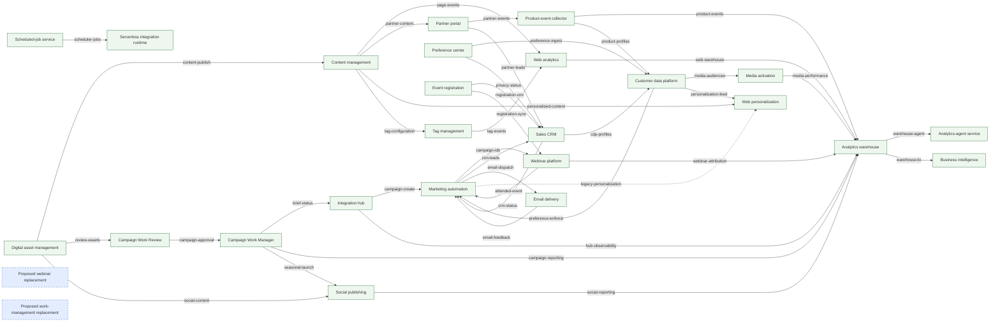

# Estate Overview

Generated from snapshot `323ba0c95a5369f202bce18fc210d0b3fe84c7977f8fa0c767a00a1ddbad750b`. Synthetic evidence.

```mermaid
%% Estate overview
%% Data-flow view only. Filtered: False. Edges shown 40/40. Truncated: False.
flowchart LR
  nd4f0bc5a29de06b5["Analytics-agent service"]
  class nd4f0bc5a29de06b5 established
  n6d65ed5c750019a1["Marketing automation"]
  class n6d65ed5c750019a1 established
  nd9065d6da185ec28["Business intelligence"]
  class nd9065d6da185ec28 established
  n700ab86bfeead33a["Customer data platform"]
  class n700ab86bfeead33a established
  n069df57a3a645590["Content management"]
  class n069df57a3a645590 established
  n0736fd5b7cc7ab7d["Product-event collector"]
  class n0736fd5b7cc7ab7d established
  n378e4e36ab7f07f0["Campaign Work Review"]
  class n378e4e36ab7f07f0 established
  n9261ceef0b969e70["Sales CRM"]
  class n9261ceef0b969e70 established
  n2fcb6465ee5cbfa3["Digital asset management"]
  class n2fcb6465ee5cbfa3 established
  n82244417f956ac7c["Email delivery"]
  class n82244417f956ac7c established
  nef7d009c7e812da1["Serverless integration runtime"]
  class nef7d009c7e812da1 established
  n08d33503ee27d4c1["Integration hub"]
  class n08d33503ee27d4c1 established
  n5d9a17cb70b9733a["Scheduled-job service"]
  class n5d9a17cb70b9733a established
  n721c9525ade2ea89["Media activation"]
  class n721c9525ade2ea89 established
  n635665459dc101ab["Proposed webinar replacement"]
  class n635665459dc101ab proposed
  n009c1b3f80ac8b88["Proposed work-management replacement"]
  class n009c1b3f80ac8b88 proposed
  n06cb75f132725b4b["Partner portal"]
  class n06cb75f132725b4b established
  nfc0e1b7a7a0857c9["Web personalization"]
  class nfc0e1b7a7a0857c9 established
  nbca6842420dbe514["Preference center"]
  class nbca6842420dbe514 established
  n29c9c30e0604515c["Event registration"]
  class n29c9c30e0604515c established
  n3e860f41a5ea92c4["Social publishing"]
  class n3e860f41a5ea92c4 established
  n978c2f8941354cf5["Tag management"]
  class n978c2f8941354cf5 established
  nae1fd358c7612a02["Analytics warehouse"]
  class nae1fd358c7612a02 established
  nc735b228353daa08["Web analytics"]
  class nc735b228353daa08 established
  nda0ef5dcf6c62181["Webinar platform"]
  class nda0ef5dcf6c62181 established
  ned9b571b57920f91["Campaign Work Manager"]
  class ned9b571b57920f91 established
  nda0ef5dcf6c62181 -->|"attended-event"| n6d65ed5c750019a1
  ned9b571b57920f91 -->|"brief-status"| n08d33503ee27d4c1
  n378e4e36ab7f07f0 -->|"campaign-approval"| ned9b571b57920f91
  n08d33503ee27d4c1 -->|"campaign-create"| n6d65ed5c750019a1
  n6d65ed5c750019a1 -->|"campaign-ids"| nda0ef5dcf6c62181
  ned9b571b57920f91 -->|"campaign-reporting"| nae1fd358c7612a02
  n9261ceef0b969e70 -->|"cdp-profiles"| n700ab86bfeead33a
  n2fcb6465ee5cbfa3 -->|"content-publish"| n069df57a3a645590
  n6d65ed5c750019a1 -->|"crm-leads"| n9261ceef0b969e70
  n9261ceef0b969e70 -->|"crm-status"| n6d65ed5c750019a1
  n6d65ed5c750019a1 -->|"email-dispatch"| n82244417f956ac7c
  n82244417f956ac7c -->|"email-feedback"| n6d65ed5c750019a1
  n08d33503ee27d4c1 -->|"hub-observability"| nae1fd358c7612a02
  n6d65ed5c750019a1 -.->|"legacy-personalization"| nfc0e1b7a7a0857c9
  n700ab86bfeead33a -->|"media-audiences"| n721c9525ade2ea89
  n721c9525ade2ea89 -->|"media-performance"| nae1fd358c7612a02
  n069df57a3a645590 -->|"page-events"| nc735b228353daa08
  n069df57a3a645590 -->|"partner-content"| n06cb75f132725b4b
  n06cb75f132725b4b -->|"partner-events"| n0736fd5b7cc7ab7d
  n06cb75f132725b4b -->|"partner-leads"| n9261ceef0b969e70
  n700ab86bfeead33a -->|"personalization-feed"| nfc0e1b7a7a0857c9
  n069df57a3a645590 -->|"personalized-content"| nfc0e1b7a7a0857c9
  n700ab86bfeead33a -->|"preference-enforce"| n6d65ed5c750019a1
  nbca6842420dbe514 -->|"preference-ingest"| n700ab86bfeead33a
  nbca6842420dbe514 -->|"privacy-status"| n9261ceef0b969e70
  n0736fd5b7cc7ab7d -->|"product-events"| nae1fd358c7612a02
  n0736fd5b7cc7ab7d -->|"product-profiles"| n700ab86bfeead33a
  n29c9c30e0604515c -->|"registration-crm"| n9261ceef0b969e70
  n29c9c30e0604515c -->|"registration-sync"| nda0ef5dcf6c62181
  n2fcb6465ee5cbfa3 -->|"review-assets"| n378e4e36ab7f07f0
  n5d9a17cb70b9733a -->|"scheduler-jobs"| nef7d009c7e812da1
  ned9b571b57920f91 -->|"seasonal-launch"| n3e860f41a5ea92c4
  n2fcb6465ee5cbfa3 -->|"social-content"| n3e860f41a5ea92c4
  n3e860f41a5ea92c4 -->|"social-reporting"| nae1fd358c7612a02
  n069df57a3a645590 -->|"tag-configuration"| n978c2f8941354cf5
  n978c2f8941354cf5 -->|"tag-events"| nc735b228353daa08
  nae1fd358c7612a02 -->|"warehouse-agent"| nd4f0bc5a29de06b5
  nae1fd358c7612a02 -->|"warehouse-bi"| nd9065d6da185ec28
  nc735b228353daa08 -->|"web-warehouse"| nae1fd358c7612a02
  nda0ef5dcf6c62181 -->|"webinar-attribution"| nae1fd358c7612a02
  classDef established fill:#edf7ee,stroke:#246634
  classDef unknown fill:#fff4cc,stroke:#946800
  classDef proposed fill:#e4edff,stroke:#265dad,stroke-dasharray:5 5
  classDef removed fill:#ffe6e6,stroke:#a51d2d
```
