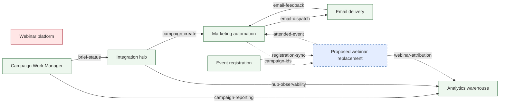

# Webinar Target State

Generated from snapshot `323ba0c95a5369f202bce18fc210d0b3fe84c7977f8fa0c767a00a1ddbad750b`. Synthetic evidence.

```mermaid
%% Proposed webinar target#59; metadata only
%% Data-flow view only. Filtered: True. Edges shown 10/40. Truncated: False.
flowchart LR
  n6d65ed5c750019a1["Marketing automation"]
  class n6d65ed5c750019a1 established
  n82244417f956ac7c["Email delivery"]
  class n82244417f956ac7c established
  n08d33503ee27d4c1["Integration hub"]
  class n08d33503ee27d4c1 established
  n635665459dc101ab["Proposed webinar replacement"]
  class n635665459dc101ab proposed
  n29c9c30e0604515c["Event registration"]
  class n29c9c30e0604515c established
  nae1fd358c7612a02["Analytics warehouse"]
  class nae1fd358c7612a02 established
  nda0ef5dcf6c62181["Webinar platform"]
  class nda0ef5dcf6c62181 removed
  ned9b571b57920f91["Campaign Work Manager"]
  class ned9b571b57920f91 established
  n635665459dc101ab -.->|"attended-event"| n6d65ed5c750019a1
  ned9b571b57920f91 -->|"brief-status"| n08d33503ee27d4c1
  n08d33503ee27d4c1 -->|"campaign-create"| n6d65ed5c750019a1
  n6d65ed5c750019a1 -.->|"campaign-ids"| n635665459dc101ab
  ned9b571b57920f91 -->|"campaign-reporting"| nae1fd358c7612a02
  n6d65ed5c750019a1 -->|"email-dispatch"| n82244417f956ac7c
  n82244417f956ac7c -->|"email-feedback"| n6d65ed5c750019a1
  n08d33503ee27d4c1 -->|"hub-observability"| nae1fd358c7612a02
  n29c9c30e0604515c -.->|"registration-sync"| n635665459dc101ab
  n635665459dc101ab -.->|"webinar-attribution"| nae1fd358c7612a02
  classDef established fill:#edf7ee,stroke:#246634
  classDef unknown fill:#fff4cc,stroke:#946800
  classDef proposed fill:#e4edff,stroke:#265dad,stroke-dasharray:5 5
  classDef removed fill:#ffe6e6,stroke:#a51d2d
```
